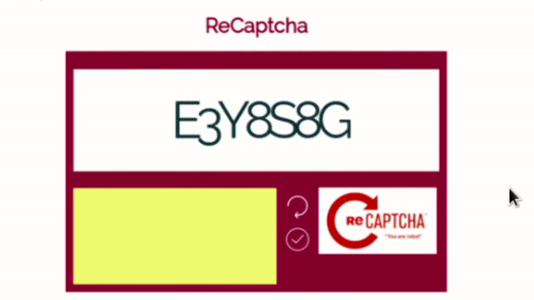

# ♡ C A P T C H A ♡

En la vida diaria usamos servicios que generan el CAPTCHA. El más usado es el de Google, puedes encontrar su documentación aquí. Estos CAPTCHA tienen como objetivo final poder identificar si eres o no un humano y van cambiando conforme avanza la tecnología.

Inicialmente consistía en un conjunto de imágenes que el usuario debía determinar el contenido de las mismas e indicarlo al sistema. Hoy en día evalúan tu comportamiento en el navegador, y de tener dudas te pide evaluar un conjunto de imágenes mucho más grande.

Armaremos un Captcha (tal cual se muestra en el diseño de abajo), este comprobará que el usuario escriba lo mismo que el Captcha que le proporcionaremos. El valor ingresado se evaluará al momento de que el usuario haga clic en el símbolo ✓ y se generará otro código cuando el usuario haga clic en el símbolo ↻.

Dato: Genera los números y letras de manera random

Math.random()

